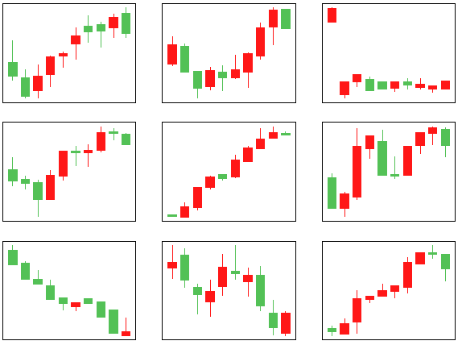

# Data Augmentation For Deep Candlestick Learner

[Chia-Ying Tsao](), [Jun-Hao Chen](o1r2g3a4n5i6z7e8@gmail.com), [Samuel Yen-Chi Chen](ycchen1989@gmail.com), and [Yun-Cheng Tsai](pecu610@gmail.com)

[[ ArXiv ]](https://arxiv.org/abs/2005.06731)

To successfully build a deep learning model, it will need a large amount of labeled data. However, labeled data are hard to collect in many use cases. To tackle this problem, a bunch of data augmentation methods have been introduced recently and have demonstrated successful results in computer vision, natural language and so on. For financial trading data, to our best knowledge, successful data augmentation framework has rarely been studied. Here we propose a Modified Local Search Attack Sampling method to augment the candlestick data, which is a very important tool for professional trader. Our results show that the proposed method can generate high-quality data which are hard to distinguish by human and will open a new way for finance community to employ existing machine learning techniques even if the dataset is small.

## Implementations

## Experiments  
To compare the performance of the two models, we design a [web-based game](https://ntuelvish.github.io/candlestick_challenge/v3/index.html) as the questionnaire.  

## Results
* Dependent Paired T Test  
The comparison between the output data of CVAE and our Modified Local Search AttackSampling model is significant.  
       ---                 |  N  |   Mean   |  Std     |  T-value |  P-value  
  ----                     | ---   | ----       |  ---       | ---------  |  -------  
  H0  | 245 |  -0.0575 |  0.2386  | -3.7736 |  0.0002

* The candlestick data generated by Modified Local Search AttackSampling model.  


## Requirements
* Numpy == 1.17.0  
* Tensorflow-gpu == 1.14.0  
* Keras == 2.2.5  
## Usages
**1. Clone and install the requirements**  
```
$ git clone https://github.com/FinancialVision.git
$ cd FinancialVision/Data Augmentation For Deep Candlestick Learner/
$ pip install -r requirements.txt
```
**2. Download data from [here](https://drive.google.com/drive/folders/1hbA3EaMrf9CZBgU6VqQcAseBHuEuQgi-?fbclid=IwAR1dqeY7Q4DCYsdTGBWopDb3W4o6-ixCzRKlUNslHMZjQKuYg_JOHeWxRJs)**  
**3. Train a CVAE model first, If needed.**
```
$ python cvae.py
```
**4. Generate augmented data with Motified Local Search Attack and CVAE model**
```
$ python adv_generator.py
$ python cvae_generator.py
```
## References
