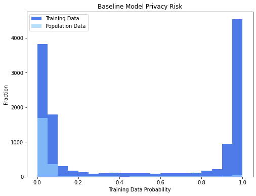
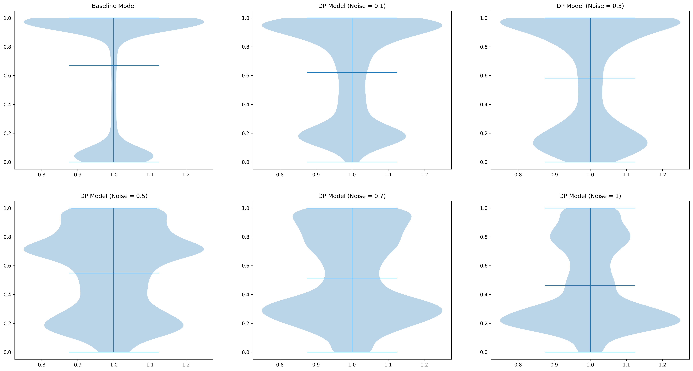

# The Protection of Data Sharing for Privacy in Financial Vision

[Yi-Jen Wang](yiren513@gmail.com) and [Yun-Cheng Tsai](pecu610@gmail.com)

The primary motivation is to address difficulties in data interpretation or a reduction in model accuracy. Although differential privacy can provide data privacy guarantees, it also creates problems. Thus, we need to consider the noise setting for differential privacy is currently inconclusive. This paper's main contribution is finding a balance between privacy and accuracy. The training data of deep learning models may contain private or sensitive corporate information. These may be dangerous to attacks, leading to privacy data leakage for data sharing. Many strategies are for privacy protection, and differential privacy is the most widely applied one. Google proposed a federated learning technology to solve the problem of data silos in 2016. The technology can share information without exchanging original data and has made significant progress in the medical field. However, there is still the risk of data leakage in federated learning; thus, many models are now used with differential privacy mechanisms to minimize the risk. The data in the financial field are similar to medical data, which contains a substantial amount of personal data. The leakage may cause uncontrollable consequences, making data exchange and sharing difficult. Let us suppose that differential privacy applies to the financial field. Financial institutions can provide customers with higher value and personalized services and automate credit scoring and risk management. Unfortunately, the economic area rarely applies differential privacy and attains no consensus on parameter settings. This study compares data security with non-private and differential privacy financial visual models. The paper finds a balance between privacy protection with model accuracy. The results show that when the privacy loss parameter $\epsilon$ is between 12.62 and 5.41, the privacy models can protect training data, and the accuracy does not decrease too much.

## Step 1. Create python 3.7 environment
conda create -m -n envname python=3.7
## Step 2. Install packages
pip install -r requirements.txt
## Step 3. Run PATE
python PATE_final.py
## Step 4. Run DP-SGD
python DPSGD_final.py

## Attack DP-SGD models 
We use the [ml\_privacy\_meter](https://github.com/privacytrustlab/ml_privacy_meter) package to attack the baseline model and the DP-SGD models to understand how much data privacy these models can provide. A tutorial can be found [Here](https://github.com/privacytrustlab/ml_privacy_meter/tree/master/archive). The below sample plot will in the logs/plots folder. The membership probability predictions for training set and population set by the model are also saved as numpy files in the logs folder as member_probs.npy and nonmember_probs.npy.



We defined the probability of training data being defined correctly by the attack model as recognition rate. The recognition rate can be visualizing by calling
``` 
python recognition_rate.py
```


